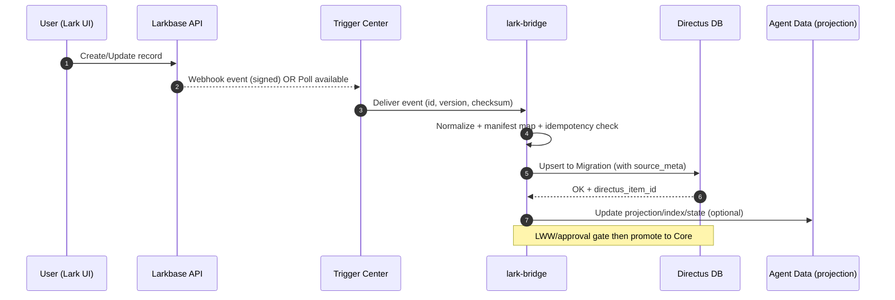

# KẾ HOẠCH HOÀN CHỈNH: Larkbase – Sheets – Directus – Agent Data

> Mục tiêu: Tối ưu luồng dữ liệu từ Larkbase và Google Sheets, vừa giải quyết nhu cầu ngắn hạn (xuất tài liệu từ Sheets thay DocuGenius), vừa dựng nền tảng dài hạn (Directus/Nuxt + projection tối thiểu vào Agent Data). Tất cả thành phần dùng chung phải dùng chung; mỗi luồng chỉ bổ sung phần khác biệt.

Có thể kết nối 2 chiều giữa Larkbase và Directus , Sheet và Directus nhằm tận dụng Larkbase và Google sheet như những UI có nhiều tính năng, và là 1 phần của hệ sinh thái web (toàn bộ dữ liệu cần được thông suốt với Directus DB và Agent data là trung tâm.

---

## 1) MỤC TIÊU & PHẠM VI

* **Ngắn hạn**: Larkbase → Google Sheets → Google Docs (Apps Script) thay DocuGenius; triển khai nhanh, ít code.
* **Dài hạn**: Larkbase/Sheets → `bridge` (dịch vụ chuẩn) → **Directus DB** (Migration → Core) → **Nuxt**; đồng thời đẩy **projection tối thiểu** (index/state) sang **Agent Data** cho AI/Agents.
* **Yêu cầu thiết kế chung**: 1) chuẩn hóa **token & secrets**; 2) **schema manifest** & **ID registry** dùng chung; 3) **trigger center** (event/polling) có idempotency; 4) **observability** & SLO; 5) **bảo mật** & WIF cho CI/CD; 6) hạn chế nhân đôi dữ liệu nghiệp vụ.

---

## 2) KIẾN TRÚC TỔNG QUAN (QUYẾT ĐỊNH CỐT LÕI)

* **SSOT** dữ liệu nghiệp vụ: **Directus DB**. Nuxt chỉ hiển thị/ứng dụng. Agent Data chỉ giữ **projection** (index/snapshot/state) phục vụ truy vấn ngữ nghĩa/tác vụ.
* **Không** kết nối "SQL↔SQL" trực tiếp giữa Larkbase và Directus; mọi tích hợp qua API → `bridge`.
* **Hai luồng song song**: (A) Lark→Sheets (ưu tiên trước mắt) và (B) Lark/Sheets→Directus (nền tảng lâu dài). Dùng **chung** token/secrets, manifest, trigger center.

### 2.1 Sơ đồ tổng quan

```mermaid
flowchart LR
  subgraph Sources[External Sources]
    L(Larkbase)
    GS(Google Sheets)
  end

  subgraph Shared[Shared Layer]
    TM(Token Manager: Lark)
    SM(Secrets & KMS)
    MF(Schema Manifest & ID Registry)
    TR(Trigger Center: webhook/poll)
    OB(Observability & SLO)
  end

  subgraph Bridges[Connectors/Bridges]
    LB(lark-bridge\nCloud Run, Node SDK)
    SB(sheets-bridge\nCloud Run, SA Google)
  end

  subgraph Platform[Platform & Stores]
    DX[(Directus DB\nMigration→Core)]
    AD[(Agent Data\nProjection/Index/State)]
  end

  subgraph Apps[Apps]
    NX(Nuxt)
    DOCS(Google Docs\n(Apps Script))
  end

  L -- API --> LB
  GS -- API/OAuth --> SB

  LB -- read/write --> DX
  SB -- read/write --> DX

  LB -- projection --> AD
  SB -- projection --> AD

  DX -- REST/GraphQL --> NX
  GS -- mail-merge --> DOCS

  TM -.token.-> LB
  SM -.secrets.-> LB
  MF -.schema.-> LB
  TR -.events.-> LB
  OB -.metrics.-> LB

  TM -.token.-> SB
  SM -.secrets.-> SB
  MF -.schema.-> SB
  TR -.events.-> SB
  OB -.metrics.-> SB
```

### 2.2 Quy tắc dữ liệu

* **Migration Zone (Directus)**: nhận dữ liệu nguồn (Lark/Sheets) + dấu vết nguồn/phiên bản.
* **Core Zone (Directus)**: dữ liệu chuẩn hoá/duyệt trở thành bản chính, có ràng buộc & chỉ mục.
* **Agent Data**: **không** lưu toàn bộ bảng nguồn; chỉ projection/index/state + `schema_version`/`schema_hash` để phát hiện drift.

---

## 3) THÀNH PHẦN DÙNG CHUNG (BẮT BUỘC)

### 3.1 Token & Secrets

* **Lark Token Manager (TM)**: module dùng chung, ưu tiên dùng **Node SDK chính thức** để auto-renew `tenant_access_token` (~120’). Cho phép **soft-cache** (Firestore) + chống stampede bằng ETag/transaction. Với Apps Script (Track A), có hàm tiện ích `getLarkToken()` (client_credentials) + cache cục bộ (PropertiesService) + refresh trước hạn.
* **Secrets**: `LARK_APP_ID`, `LARK_APP_SECRET` (Secret Manager, asia-southeast1). Runtime trên Cloud Run truy xuất bằng SA; CI/CD qua **Workload Identity Federation** (GitHub→GCP).

### 3.2 Schema Manifest & ID Registry

* **Schema Manifest**: JSON/YAML mô tả base→table→fields/relations/automation; có `version` + `schema_hash`. Dùng cho crawl, mapping và drift-detect.
* **ID Registry**: ánh xạ ID giữa Lark/Sheets/Directus (ví dụ: `lark_record_id` ↔ `directus_item_id`). Bắt buộc để idempotency & khôi phục.

### 3.3 Trigger Center (Webhooks & Pollers)

* **Webhooks** (nếu Lark/Sheets hỗ trợ): xác thực chữ ký/HMAC; **rate limit** (token bucket); retry (exponential backoff).
* **Pollers**: Cloud Scheduler + bridge gọi API theo trang/cursor; dùng **since=updated_at**; mỗi lần poll ghi `checkpoint` (Watermark) để không trùng lặp.
* **Idempotency**: header `Idempotency-Key` + bảng `sync_log` (status, checksum, source_version).

### 3.4 Observability & SLO

* **Logs** cấu trúc: entity/context/operation; **metrics**: P95 latency, error-rate, sync-lag; dashboard & alert (token lỗi, 401/429, drift tăng).

### 3.5 Bảo mật

* **Cloud Armor** trước bridge (RL); **IAM** tối thiểu; SA riêng cho runtime; Secrets không lộ.

---

## 4) HAI LUỒNG DỮ LIỆU (THIẾT KẾ CỤ THỂ)

### 4.1 Luồng A — Larkbase → Google Sheets → Google Docs (ưu tiên)

* **Runner**: Google Apps Script (time-driven triggers).
* **Bước**:

  1. `getLarkToken()` (client_credentials) + cache/refresh.
  2. `listRecords(app, table, cursor)` → build mảng dữ liệu chuẩn.
  3. Ghi **Sheets** (batch) theo header mapping cố định.
  4. (Tùy chọn) Tạo **Docs** từ template (merge fields) cho hợp đồng/CV.
  5. Ghi `schema_hash` + `watermark` (last_updated) vào sheet `Config`.
* **Khác biệt luồng A**: chạy độc lập, không cần hạ tầng GCP. **Vẫn dùng chung** manifest (để sau này chuyển sang Directus không sửa lại map).

### 4.2 Luồng B — Lark/Sheets → Bridge → Directus → Nuxt (+ Projection Agent Data)

* **Bridge**: `lark-bridge` + `sheets-bridge` (Cloud Run, min=0).
* **Bước**:

  1. **Ingest** (webhook/poll) → normalize bằng manifest.
  2. **Upsert** vào Directus (Migration) + lưu `source_meta` (origin, version, checksum).
  3. **Promote** sang Core qua Flow/Rules (ràng buộc, duyệt, mapping business).
  4. **Projection** sang Agent Data (index/state) nếu cần.
  5. Nuxt đọc từ Directus API.
* **Khác biệt luồng B**: hạ tầng bền vững, scale, audit, rollback.

---

## 5) THIẾT KẾ TRIGGER & ĐỒNG BỘ

* **Chiến lược 3 giai đoạn**: 1) Shadow Read (chỉ đọc, đo SLO) → 2) Dual-Write (ghi song song, **LWW(updated_at, rev)**) → 3) Cutover (Directus làm nguồn chính; Lark/Sheets giữ vai UI/tiện ích).
* **Xung đột**: ưu tiên **LWW**; với form quan trọng cần “approval gate” trước khi promote sang Core.
* **Khôi phục**: dựa `sync_log` + `ID registry`; re-run theo `checkpoint`.

### 5.1 Sơ đồ trình tự mẫu (Lark update → Directus)



---

## 6) ĐẶC TẢ NHẸ (DÙNG CHUNG)

### 6.1 Manifest YAML (mẫu)

```yaml
version: 1
schema_hash: <computed>
sources:
  - name: larkbase
    base_id: <BASE_ID>
    tables:
      - name: students
        keys: [student_id]
        fields:
          - from: full_name
            to: name
          - from: dob
            to: dob
          - from: phone
            to: contact.phone
        ownership: migration  # hoặc core khi promote
  - name: sheets
    spreadsheet_id: <SHEET_ID>
    sheets:
      - name: students_sheet
        map_to: students
        header_row: 1
```

### 6.2 ID Registry (mẫu)

```yaml
registry:
  students:
    - lark_record_id: rc_123
      directus_item_id: 456
      sheets_row: 27
      version: 5
```

### 6.3 OpenAPI (rút gọn) cho Bridges

```yaml
/lark/health: {get: {summary: Health}}
/lark/whoami: {get: {summary: Verify token}}
/lark/base/{table}/records:
  get: {summary: List/Query, params: [cursor, updated_since]}
  post: {summary: Create/Upsert, headers: [Idempotency-Key]}
  put: {summary: Update}
  delete: {summary: Delete}
/schema/crawl: {post: {summary: Snapshot manifest+hash}}
```

---

## 7) LỘ TRÌNH TRIỂN KHAI & GATE

### Tuần 1 — Luồng A (ưu tiên)

* Apps Script: auth Lark + list records + ghi Sheets + `schema_hash` & `watermark`.
* Template Docs + merge; báo cáo nhật trình hằng ngày.
* **DoD**: xuất đủ 3 bảng pilot; Docs sinh tự động.

### Tuần 2 — Nền tảng dùng chung + Bridge

* Secrets + WIF; `lark-bridge` với `/health` & `/whoami`.
* `/schema/crawl` + `/records` (list/create/update/delete) + idempotency.
* **DoD**: CP-F1/F2 xanh; dashboard token/error/sync-lag.

### Tuần 3 — Đồng bộ & Promote

* Shadow Read → Dual-Write 1 bảng thí điểm; promote sang Core có approval gate.
* **DoD**: cutover an toàn; rollback kế hoạch thử nghiệm.

---

## 8) RỦI RO & GIẢM THIỂU

* **Token hết hạn/401**: SDK auto-renew + soft-cache + alert.
* **Drift schema**: `schema_hash` + cảnh báo; chạy `/schema/crawl` định kỳ.
* **Rate limit/429**: backoff + batching + checkpoint cursor.
* **Nhân đôi dữ liệu**: cấm ghi trực tiếp ngoài bridge; enforce Migration→Core.
* **Bảo mật**: Cloud Armor RL, IAM tối thiểu, Secrets Manager; ký webhook.

---

## 9) DELIVERABLES

* Apps Script (Luồng A) + hướng dẫn mapping Sheets → Docs.
* Dịch vụ `lark-bridge` & `sheets-bridge` (Cloud Run) + OpenAPI.
* `schema_manifest.(yaml|json)` + `id_registry.(yaml|json)`.
* Dashboard SLO + Runbook (token/webhook/rollback).
