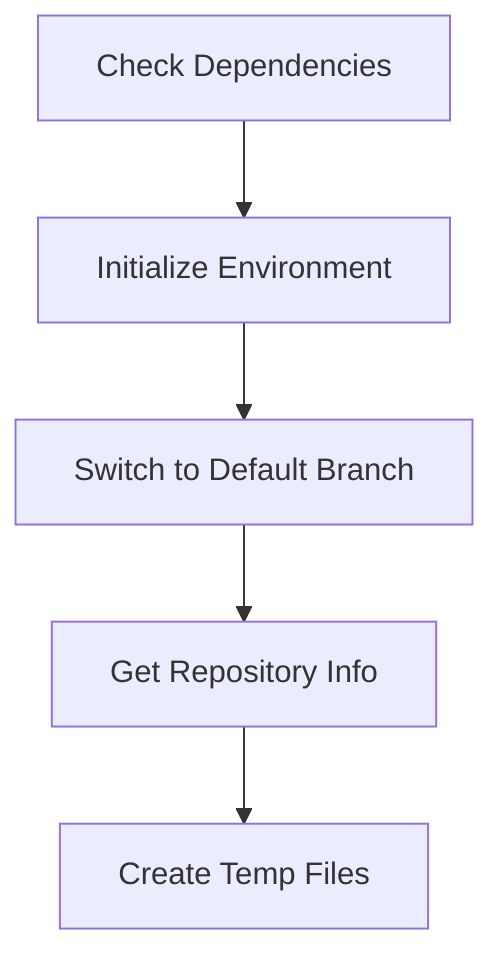
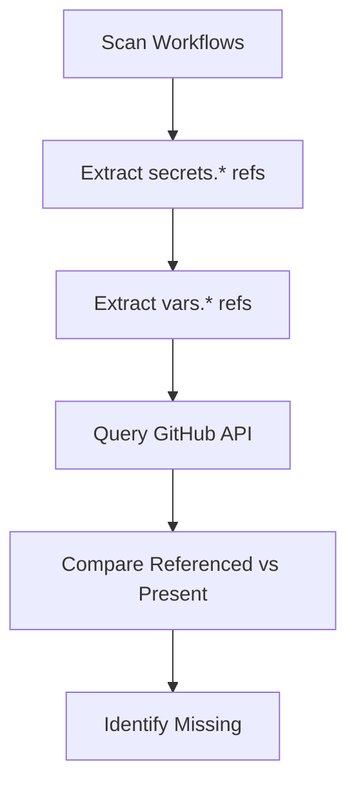
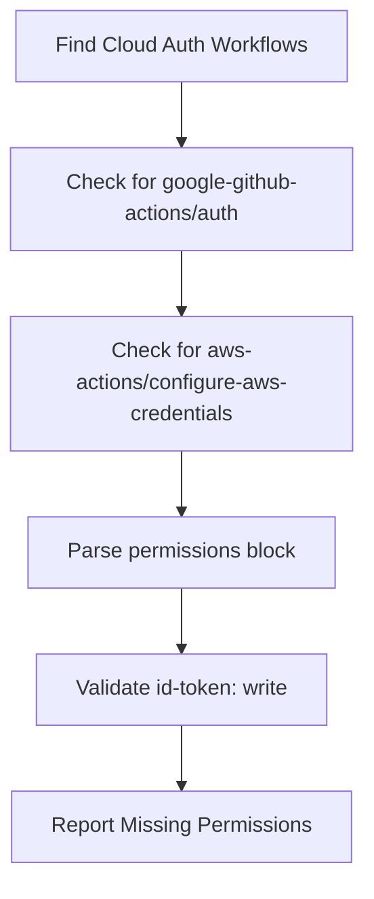
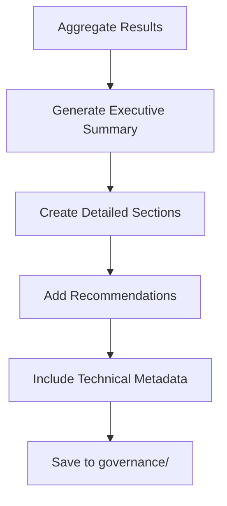
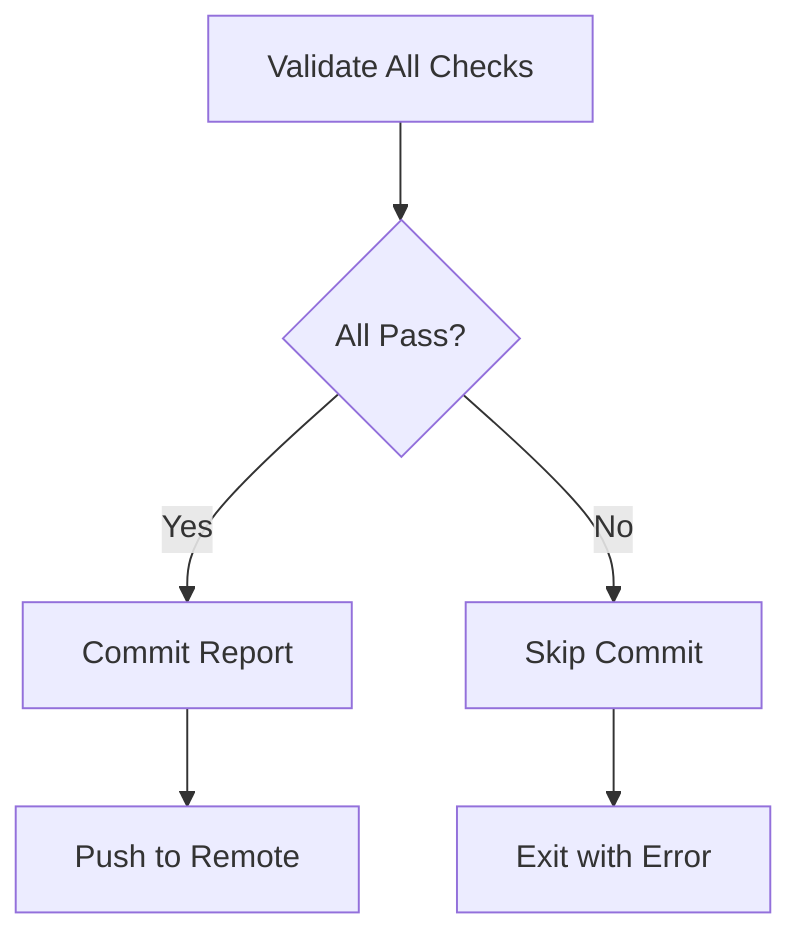

# M5.PRE-CLI-01 — Preflight Secrets & Permissions

## Overview

Script `M5.PRE-CLI-01` thực hiện kiểm tra toàn diện về secrets và permissions trước khi deploy Terraform/WIF. Đây là một phần quan trọng trong quy trình bảo mật, đảm bảo tất cả các requirements đã được đáp ứng trước khi tiến hành deployment.

## Features

### 🔍 **Comprehensive Validation**
- ✅ Trích xuất tất cả secrets/variables được tham chiếu trong workflows
- ✅ Đối chiếu với secrets/variables thực tế từ GitHub API
- ✅ Kiểm tra permissions cho workflows sử dụng cloud authentication
- ✅ Validé workflow health và recent run status
- ✅ Tạo báo cáo chi tiết với recommendations

### 🛡️ **Security Compliance**
- ✅ Idempotent execution (có thể chạy nhiều lần an toàn)
- ✅ Evidence-based validation (tất cả dựa trên dữ liệu thực)
- ✅ Fail-fast mechanism (dừng ngay khi phát hiện lỗi)
- ✅ Commit/push chỉ khi PASS (không lưu trữ báo cáo failed)

### 📊 **Detailed Reporting**
- ✅ Executive summary với pass/fail status
- ✅ Detailed breakdown của tất cả findings
- ✅ Actionable recommendations
- ✅ Technical metadata và provenance
- ✅ Compliance notes và audit trail

## Requirements

### System Dependencies
```bash
# Required tools
gh          # GitHub CLI (authenticated)
git         # Git command line
jq          # JSON processor
```

### Repository Setup
- GitHub repository với workflows trong `.github/workflows/`
- GitHub CLI đã authenticated với proper permissions
- Repository phải có remote origin configured

### Permissions Required
Script cần access đến:
- Repository secrets (read)
- Repository variables (read)
- Repository environments (read)
- Workflow runs (read)
- Workflow permissions (read)

## Usage

### Basic Usage
```bash
# Run full preflight check
./scripts/m5_preflight_secrets_permissions.sh

# Run with verbose output
./scripts/m5_preflight_secrets_permissions.sh --verbose

# Dry run (no commit)
./scripts/m5_preflight_secrets_permissions.sh --dry-run

# Show help
./scripts/m5_preflight_secrets_permissions.sh --help
```

### Integration with CI/CD
```yaml
# Example GitHub Actions integration
- name: M5 Preflight Check
  run: |
    bash scripts/m5_preflight_secrets_permissions.sh
  env:
    GITHUB_TOKEN: ${{ secrets.GITHUB_TOKEN }}
```

## Script Logic Flow

### 1. **Initialization**


### 2. **Secret Analysis**


### 3. **OIDC Validation**


### 4. **Report Generation**


### 5. **Commit Logic**


## Output Structure

### Console Output
```
[INFO] Starting M5.PRE-CLI-01 - Preflight Secrets & Permissions Check
[INFO] Repository: owner/repo
[INFO] Found 11 referenced secrets and 0 referenced variables
[SUCCESS] All preflight checks passed!
[SUCCESS] Report committed and pushed
```

### Report File
```
governance/preflight_M5_YYYYMMDDTHHMMSSZ.md
```

**Report Sections:**
1. **Metadata** - Repository, branch, timestamp, version
2. **Executive Summary** - Pass/fail status với issue count
3. **Referenced Secrets** - Tất cả secrets được tham chiếu
4. **Missing Secrets** - Secrets thiếu cần thêm
5. **Referenced Variables** - Tất cả vars được tham chiếu
6. **Missing Variables** - Variables thiếu cần thêm
7. **OIDC Workflows** - Workflows sử dụng cloud auth
8. **Missing Permissions** - Workflows thiếu id-token: write
9. **Workflow Permissions** - Repository default permissions
10. **CI/CD Health** - Status của key workflows
11. **Recommendations** - Actionable steps để fix issues
12. **Compliance Notes** - Audit và compliance info
13. **Technical Details** - Provenance và metadata

## Common Issues & Solutions

### 🚨 **Missing Secrets**
**Problem:** Workflow references secrets không tồn tại
```
❌ Missing secrets:
  - OPENAI_API_KEY
  - SLACK_WEBHOOK_URL
```

**Solution:**
1. Navigate to GitHub repository settings
2. Go to "Secrets and variables" → "Actions"
3. Add missing secrets với proper values
4. Re-run preflight check

### 🚨 **Missing OIDC Permissions**
**Problem:** Cloud auth workflows thiếu permissions
```
❌ Workflows missing OIDC permissions:
  - .github/workflows/deploy.yml
```

**Solution:**
```yaml
# Add to workflow file
permissions:
  id-token: write
  contents: read
```

### 🚨 **API Authentication Failed**
**Problem:** GitHub CLI không authenticated
```
ERROR: GitHub API authentication failed
```

**Solution:**
```bash
# Authenticate GitHub CLI
gh auth login

# Verify authentication
gh auth status
```

### 🚨 **Workflow Parse Errors**
**Problem:** Invalid YAML trong workflows
```
ERROR: Could not parse workflow file
```

**Solution:**
1. Validate YAML syntax
2. Check indentation
3. Verify workflow structure

## Best Practices

### 🎯 **Pre-Deployment**
1. Always run preflight check trước Terraform deployment
2. Fix tất cả issues trước khi proceed
3. Verify report shows "PASS" status
4. Review recommendations thoroughly

### 🎯 **Repository Management**
1. Keep secrets minimal và necessary only
2. Use environment-specific secrets khi appropriate
3. Regular audit secrets usage
4. Remove unused secrets

### 🎯 **Workflow Design**
1. Include proper permissions blocks
2. Use least-privilege principle
3. Document cloud authentication requirements
4. Test workflows thoroughly

### 🎯 **Security Governance**
1. Review preflight reports trong security reviews
2. Archive reports cho audit trails
3. Track trends trong missing secrets/permissions
4. Implement automated fixes nếu possible

## Integration Examples

### Pre-commit Hook
```bash
#!/bin/bash
# .git/hooks/pre-push
echo "Running M5 preflight check..."
if ! ./scripts/m5_preflight_secrets_permissions.sh --dry-run; then
    echo "❌ Preflight check failed. Fix issues before pushing."
    exit 1
fi
echo "✅ Preflight check passed"
```

### Makefile Integration
```makefile
.PHONY: preflight
preflight:
	@echo "Running M5 preflight check..."
	@./scripts/m5_preflight_secrets_permissions.sh

.PHONY: preflight-dry
preflight-dry:
	@echo "Running M5 preflight check (dry run)..."
	@./scripts/m5_preflight_secrets_permissions.sh --dry-run

deploy: preflight
	@echo "Proceeding with deployment..."
	@terraform apply
```

### GitHub Actions Workflow
```yaml
name: M5 Preflight Check

on:
  pull_request:
    paths:
      - '.github/workflows/**'
      - 'terraform/**'

  workflow_dispatch:

jobs:
  preflight:
    name: M5 Preflight Secrets & Permissions
    runs-on: ubuntu-latest
    permissions:
      contents: write
      actions: read

    steps:
      - name: Checkout
        uses: actions/checkout@v4

      - name: Run Preflight Check
        run: |
          ./scripts/m5_preflight_secrets_permissions.sh
        env:
          GITHUB_TOKEN: ${{ secrets.GITHUB_TOKEN }}

      - name: Upload Report
        uses: actions/upload-artifact@v4
        if: always()
        with:
          name: preflight-report
          path: governance/preflight_M5_*.md
```

## Exit Codes

| Code | Meaning | Description |
|------|---------|-------------|
| `0` | Success | All checks passed successfully |
| `1` | Validation Failed | Missing secrets/permissions detected |
| `1` | Dependency Missing | Required tools not available |
| `1` | Authentication Failed | GitHub CLI not authenticated |
| `1` | Repository Error | Not in git repository or no remote |

## Environment Variables

| Variable | Description | Default | Required |
|----------|-------------|---------|----------|
| `GITHUB_TOKEN` | GitHub API token | From `gh auth` | ✅ |
| `DRY_RUN` | Skip commit when set | `false` | ❌ |

## Troubleshooting

### Debug Mode
```bash
# Enable debug output
./scripts/m5_preflight_secrets_permissions.sh --verbose

# Check script dependencies
which gh git jq

# Verify GitHub authentication
gh auth status

# Check repository status
git status
git remote -v
```

### Manual Validation
```bash
# Check specific secrets manually
gh api repos/OWNER/REPO/actions/secrets

# Check specific workflow
gh api repos/OWNER/REPO/actions/workflows

# Check recent runs
gh run list -L 5
```

### Log Files
```bash
# Script generates detailed console output
./scripts/m5_preflight_secrets_permissions.sh 2>&1 | tee preflight.log

# Check generated reports
ls -la governance/preflight_M5_*.md
```

## Related Documentation

- [GitHub Actions Security](https://docs.github.com/en/actions/security-guides)
- [OIDC Integration](https://docs.github.com/en/actions/deployment/security-hardening-your-deployments)
- [Secrets Management](https://docs.github.com/en/actions/security-guides/encrypted-secrets)
- [Workflow Permissions](https://docs.github.com/en/actions/using-workflows/workflow-syntax-for-github-actions#permissions)

## Version History

| Version | Date | Changes |
|---------|------|---------|
| `M5.PRE-CLI-01` | 2025-08-15 | Initial release với full functionality |

## Support

For issues or questions về M5 Preflight script:

1. Check troubleshooting section
2. Review generated reports trong `governance/`
3. Verify GitHub CLI authentication
4. Check repository permissions
5. Create issue với detailed error logs
